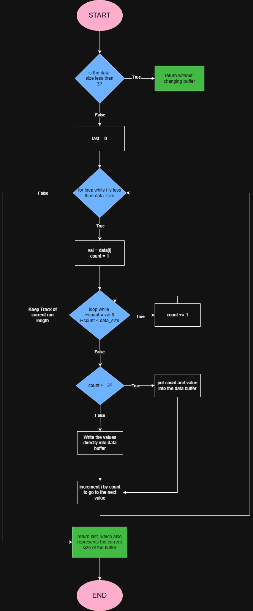

# Garmin Compression Assignment

Hello! This README will act as documentation for my thought process and design decisions when completing this problem. 

A Makefile is provided for you to compile the program easily, simply run `make` in the root directory of the repository. To clean up the object and executable files run `make clean`.

The program captures input bytes from stdin and writes them to stdout. Run it like this:

```
./codec c - for compression

./codec d - for decompression
```

There is a testing harness provided. Feel free to use it to generate your own test cases. The testing process is outlined in the testing section. Make sure the code is compiled before using it.

1. [Thought Process](#thought-process)

2. [Alternative Algorithms](#alternative-algorithms)

3. [Flowchart](#flowchart)

4. [Testing](#testing)

5. [References](#references)

## Thought Process

My initial thoughts on reading the problem were to make use of the information from assumption one, specifically "each byte will contain a number from 0 to 127" and "same value repeated in a series". These pieces of information were strong hints to my solution of the problem, which was to simplify the representation fo a byte stream into a series of counts and its corresponding byte:

```
output = {count, byte, count, byte, ...}
```

Then I noticed that I can't turn every single byte into a series like this, because this would risk the algorithm actually taking up more space than it was originally. As a simple example:

```
input = {0x11}

with this algorithm, my output would then be (assuming no illegal memory access):

output = {0x01, 0x11}
```

As you can see, the byte array ends up taking MORE space than the input. Therefore, if the number of times a value repeats in the series is less than three, it is unnecessary to store the count in the byte array (for two byte repeated sequences it doesn't matter, so I elected to just keep those as they are). 

However, this gives rise to a new problem. If we don't have the conisistent `count, byte` pattern, then how can we differentiate between counts and bytes in the array when decompressing? The solution to this is presented in the fact that the range of each byte is only 0-127. This leaves the upper range of 128-255 (or 0x80 to 0xFF) free to use. In this way, counts can be recognized if they are >=0x80 and converted back to their true value by subtracting 0x80 as well. An example is shown here:

```
Input = {0x11, 0x05, 0x05, 0x05, 0x22, 0x22}

Output = {0x11, 0x03, 0x05, 0x22, 0x22}
                  ^
                  |
                count
```

When decompressing, you would simply have to iterate and check if the current value is less than 0x80. If it is, add it directly to the buffer of uncompressed data. If it isn't, take the value at the next index and add it as many times as specified by the count value.

## Alternative Algorithms

After analyzing the problem, I explored several well-known data compression algorithms to identify viable alternatives.

The above algorithm is more commonly known as RLE (Run Length Encoding). RLE compresses consecutive identical values, called runs, by replacing each run with a pair consisting of the data value and the number of occurrences.

Other common algorithms are summarized in the following table:

| Name | Description | Complexity | In-Place | Other Data Structures | Notes |
|------|:-------|------|------|------|------|
| RLE | repetitive sequences collapsed to `count, value` | Low | ✅ | ❌ | good for data with lots of repetitive sequences, works well in this context |
| Huffman Encoding | shorter bit codes assigned to frequent symbols | Medium | ⚠️ (possible but difficult) | ✅ | uses a Huffman tree to store meanings of bit values, not really gonna work in this context as you can only return data size and you need a huffman tree to decompress as well |
| LZ77 | dictionary based algorithm that stores repeated patterns as triples of `(offset, length, next character)` | High | ❌ | ✅ | involves dividing the input data into a sliding window that acts as a "history" buffer and a look-ahead buffer. powerful dictionary-based encoding but too complex for in-place |


Given the constraints of the problem, I felt that the best solution was an **RLE-like implementation** with the modifications described in the previous section. It provides the simplest in-place algorithm, minimal memory overhead, and avoids the use of auxilliary data structures. 

## Flowchart

Here is the flowchart for the compression algorithm.




## Testing

To properly test my code, I also wrote the decompression function descibed at the end of the thought process section which would help validate the lossless compression. Then I created a main file to host some basic I/O processing and facilitate the testing process.

I decided to use python as the test harness for the program because it's simple and I was already familiar with it's subprocess library. The code hosts a couple handwritten test cases and generates some random ones, then hosts a subprocess, writes to it's stdin and captures the output. In each test case, it will compare the original data with the data after decompression and failing if it returns false. If the case is successful, the compression ratio is also displayed. 

I wrote a few edge cases myself and a loop that can generate very large test cases at varying epsilons. The epsilon defines the degree of repetition found in the byte stream, with 0 meaning there is no bias towards repetition and 1 meaning there is only repetition. At high epsilon, this accurately simulates the context provided in the problem description, and you will notice that the compression ratio is much smaller at higher epsilon which is how the algorithm should be working.


## References

- [Huffman Encoding Video - Pizzey Technology](https://www.youtube.com/watch?v=iEm1NRyEe5c)
- [Run Length Encoding - GeeksForGeeks](https://www.geeksforgeeks.org/dsa/run-length-encoding/)
- [LZ77 Explanation - Hackernoon](https://hackernoon.com/how-lz77-data-compression-works-yk113te0)