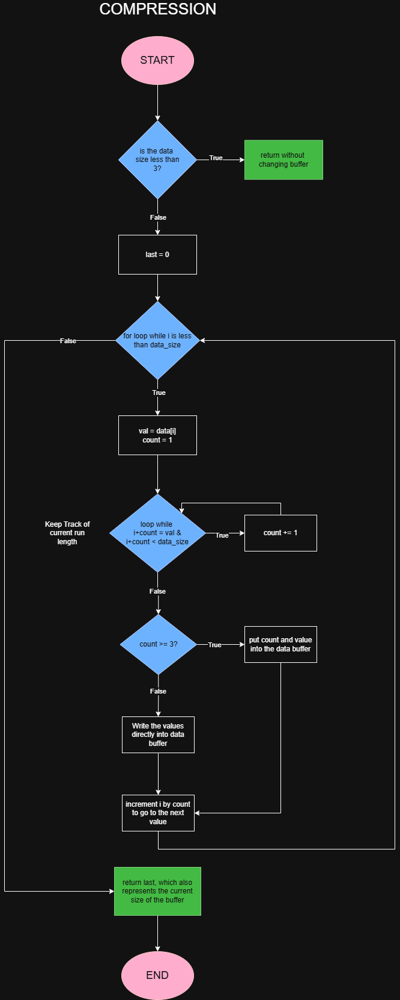

# Garmin Compression Assignment

Hi there! Just wanted to thank you again for this opportunity. This README will act as documentation for my thought process and design decisions when completing this problem. 

1. [Thought Process](#thought-process)

2. [Alternative Algorithms](#alternative-algorithms)

3. [Flowchart](#flowchart)

4. [Testing](#testing)

## Thought Process

My initial thoughts on reading the problem were to make use of the information from assumption one, specifically "each byte will contain a number from 0 to 127" and "same value repeated in a series". These pieces of information were strong hints to my solution of the problem, which was to simplify the representation fo a byte stream into a series of counts and its corresponding byte:

```
output = {count, byte, count, byte, ...}
```

Then I noticed that I can't turn every single byte into a series like this, because this would risk the algorithm actually taking up more space than it was originally. As a simple example:

```
input = {0x11}

with this algorithm, my output would then be (assuming no illegal memory access):

output = {0x01, 0x11}
```

As you can see, the byte array ends up taking MORE space than the input. Therefore, if the number of times a value repeats in the series is less than three, it is unnecessary to store the count in the byte array (for two byte repeated sequences it doesn't matter, so I elected to just keep those as they are). 

However, this gives rise to a new problem. If we don't have the conisistent `count, byte` pattern, then how can we differentiate between counts and bytes in the array when decompressing? The solution to this is presented in the fact that the range of each byte is only 0-127. This leaves the upper range of 128-255 (or 0x80 to 0xFF) free to use. In this way, counts can be recognized if they are >=0x80 and converted back to their true value by subtracting 0x80 as well. An example is shown here:

```
Input = {0x11, 0x05, 0x05, 0x05, 0x22, 0x22}

Output = {0x11, 0x03, 0x05, 0x22, 0x22}
                  ^
                  |
                count
```

## Alternative Algorithms

After stepping through the problem myself, I decided to research alternative algorithms that are used for compressiong. 

The above algorithm is more commonly known as RLE (Run Length Encoding). RLE describes each sequence of identical values as a run. When it finds a run, it's replaced by a pair, the data value and the count of the ocurrence. 

Other common algorithms are summarized in the following table:

| Name | Description | Simple | In-Place | Notes |
|------|:-------|------|------|------|
| RLE | repetitive sequences collapsed to `count, value` | ✅ | ✅ | |

## Flowchart

Here is the flowchart for the compression algorithm.




## Testing